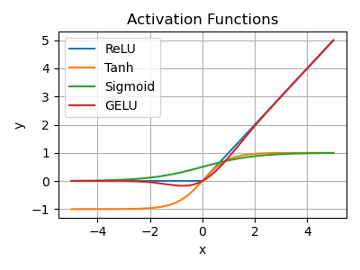

# NLP_research_interviews

## Generative AutoEncoder Models Comparison
### AE vs VAE
### VAE vs Diffusion model

## Boosting

## NLG Metrics
- BLEU: Range 0 to 1, based on **Precisions of n-gram**. Short sentence tends to get high value, therefore length penalty.
- ROUGE: Based on **Recall**, 4 different methods: Rouge-L (longest common subsequence), Rouge-N (n-gram recall), Rouge-W (weighted longest common subsequence), Rouge-S (n-gram, but allow skip). Recall, which means how many n-gram of the reference are matched by the generated sequence.
- Precision, Recall and F1: Accuracy is not good enough for **imbalance** dataset. Precision: For all positive prediction, what's the percentage for true positive. Recall: For all positive data, what's the percentage that are successfully predicted as positive. When **False negative** is expensive, Recall > Precision. When **False positive** is expensive, Precision > Recall. F1 is a combination of Recall and Precision. For multi-class classification problem, each class has its own Precision and Recall. To consider overall classification performance in one score, there are three methods to calcualte: Macro-average, Weighted-average and Micro-average.  
- ROC-AUC: ROC curve (receiver operating characteristic curve) is a graph showing the performance of a classification model at all classification **thresholds**.
- Diversity: Diff n-gram.

## Softmax details
The typical expression for softmax function:  
```math
\sigma(\mathbf{z})_i = \frac{e^{z_i}}{\sum_{j=1}^{N} e^{z_j}}
```
However, $z_i$ can be some extreme values which affect the stability of softmax. Therefore a stabler version is   
```math
\sigma(\mathbf{z})_i = \frac{e^{z_i - \max(\mathbf{z})}}{\sum_{j=1}^{N} e^{z_j - \max(\mathbf{z})}}
```


## Loss function
### Regression loss
- Mean Absolute Error (MAE): L1 loss, not sensitive (robust) to outlier datapoint. Therefore, better choice when there are many outliers in the dataset. MAE **not continuous**, therefore not differentiable when f(x)=0. The **gradient for MAE is almost constant**, when when the loss is small, which is not good for **convergence**, but would not lead to **gradient explode**. When there is **small noise** on the dataset (<<1), the loss will **scale linearly**. 
- Mean Squared Error (MSE): L2 loss, sensitive (not robust) to outlier datapoint. Therefore, better choice when the outlier features are **desired**. MSE is smooth, continuous and differentible, therefore **gradient descent** can be used. The gradient reduces when loss is small, which is **good for convergence**. When there is small noise on the dataset (<<1), the loss will **scale less** (square rate). 
- Smooth L1 loss: Converge faster than L1 and less sensitive (less gradient explode) to outliers than L2. Used in Faster R-CNN. 
### classification loss
- Cross Entropy (BCE):
- Why MSE cannot be used on classification problem: 

## DL training details
### Miscellaneous details
- K-fold: 2-fold has problems 1) Model performance depends on the splitting of train and valid set. 2) Model only trained on part of the data. Therefore ** cross-validation**, split dataset into k portion. Iteratively train k models and evaluate on the k valid sets. The average loss is more accurate.
- How to tune hyper-parameters (such as lr)
- Overfit/underfit: If **overfitting**, two possible solutions: 1) **Regularization**, keep all features but reduce number of parameters. 2) **Remove noisy features** by hand or methods such as PCA.
- Batch Normalization 

### Regularization
  

- **L1, L2**: Regularization can alleviate overfitting and improve ability to generalize. L1 is equivalent to Laplace prior (sum of absolute value), L2 is Gaussian prior (sum of squared value). Prior means the prior knowledge of the value distribution of weights/parameters. L1 tends to give **sparse parameters**, while L2 tends to give parameters with **small values**. (Sparse parameter is good because less parameters are used, some weights become 0. It can be helpful for **feature selection** and therefore provide **interpretability**. Small parameter value is good because a samll change of the input data wouldn't give large shift on the predicting result, which means more robustness. More parameters are used means the model wouldn't only depend on few features, which provide generalization ability.) L1 doesn't provide an analytical solution (due to the absolute operation), but it can be compatible with sparse algorithms, while L2 has analytical solution, as it keeps the loss **continuous** and therefore can be calculated more **efficiently by gradient descent**. L1 is not sensitive with abnormal data/parameters, as L2 will emphasis them. Therefore L1 is more robust for noisy situation, but L2 is better choice when the anormaly is valuable for the study. 
- **Dropout**: 1) Dropout is equivalent to train multiple submodels with randomly less neuros, which means when predicting, model works like voting. 2) Increase robustness, as features are forced to depend on different neurons, rather than a fixed set of neurons.

### Normalization
- Why Normalization:
Independent and identically distributed (**i.i.d**), also notnecessary for all ML method, but can simplify the training and improve the inference. Therefore, **whitening** is an important preprocessing step for two reasons: 1. make features independent. 2. make all features same mean and variance.
However, **Internal Covariate Shift (ICS)** happens in DL: Signal distributions keep increasingly shifting with deeper layers, but label distribution is fixed, which means there is a covariate shift.
ICS may lead to slower learning speed (deeper layer learns different distributions), early stopping (saturated) and layers training becomes dependent.

- **Batch Normalization & layer normalization**: Batch is for **a batch of data**, while Layer is for **a single datapoint**. Batch is normalizing **across the same features**, while Layer is normalizing **across all features**. The batch normalization could be applied on the input data as well as **the output of each layer**. The mean and variance of the normalization are **learnt during training** and used during inference.
LN is not affectedd by mini-batch distribution (allow small batch or RNN), no need for storing mean and variance, but if input features have very different nature, LN may reduce the expressiveness of models.
- **Weight Normalization**: Use the neuro weights to sacle the input features.
- **Cosine Normalization**:
- Why Normalization works:
1) Weight scale invariance: $Norm(W'x)=Norm(Wx)$, $W'=\lambda W$, scaled weight. Therefore normalization does not affect back-propogation, but can allow higher lr.
3) Data scale invariance: $Norm(Wx')=Norm(Wx)$, $x'=\lambda x$, scaled data. Mitigate gradient vanishing or explosion. 
- **Early stopping**

### Gradient vanish & explode
They both result in unstable gradient. They are caused by
- **Too deep** NN (too many layers). For a deep NN with multiple layers, if the average gradient > 1, gradient updates will increase exponentially, which leads to gradient explode. The top layer will be updated much faster than the bottom layers. If the average gradient < 1, gradient vanishing.
- The choice of **activation functions** could lead to increasing/decreasing average gradients.
- Too large **initial weights**.
Potential solution:
- Use ReLU, Leaky-ReLU rather than Sigmoid or tanh.
- Batch normalization.

### Activation functions
Why do we want activation functions?
The development of activation functions: Sigmoid->Tanh->ReLU->Leaky ReLU->Maxout
- Sigmoid: Value range [0,1], which is suitable for outputing probability. Outdated for latest NN. Limitations: 1) Sigmoid could get **saturated** and lead to **gradient vanish** when value goes to 0 or 1, which means too small backward propogation error. 2) Sigmoid is **[not zero-centered](https://rohanvarma.me/inputnormalization/)**, which leads to zipzap trajectory when gradient descent. 3) The gradient of Sigmoid ranges (0, 0.25), back propogation could lead to gradient vanishing.
- Tanh: Value range (-1, 1). **Zero-centered**, but still has problem of **saturation**. (Too prevent saturation, the latest popular method is to have a **batch normalization** before activation function.)
- ReLu: Greatly **speed up** the convergence of **stochastic gradient descent**. When **calcualting gradient, ReLU almost consumes no computation**, while Sigmoid and Tanh requires differentiating exp. Character: 1) Single-side inhibition. 2) Relatively wide active range. 3) Sparse activation. Limitations: ReLU unit is vulnerable and could irreversible die. (A proper learning rate could lower the chance of killing a ReLU.)
- Leaky ReLU: Give a very small negative gradient, which means the negative gradient woundn't lost completely.
- GELU: A smoother version of ReLU, can go to negative values when $x<0$. GELU is the only activation function whose derivative can be negative value. (Not monotonically increasing)   
  


### Attention vs LSTM
RNN is hard to parallelize because of its sequential nature. CNN can parallelize, but each filter/kernel can only see limited vectros. Filters from higher layer have potential to see more vectors. Self-attention layer has Q, K, V and token at any position can attend other tokens at any positions. Self-attention has similar idea with CNN, but has more parameters and therefore is more flexible and needs more training data, e.g. ViT has 300M training pictures, but if only trained on ImageNet, its performance is worse than CNN. 

## Optimization methods
### SGD

## Decoding method
- [Greedy, top-k and top-p](https://docs.cohere.ai/docs/controlling-generation-with-top-k-top-p): Greedy, always pick the token with highest likelihood. Top-k, pick top-k tokens and sample from them based on their likelihood. Top-p (Nucleus sampling), pick top-p tokens whose probability add up to a threshold e.g. 75%, and sample from them based on their likelhood.
- Beam search
- Classifier-conditioned decoding methods, e.g. FUDGE
- LogicDecoding, Entropy-based decoding

## Tokenizer
- Classic tokenizer: Word by word. Limitations: OOV, low frequency words cannot get trained (trimmed for the size of the vocabulary.). Cannot link the connections between words with the same root, e.g. old, older and oldest.
- Character embedding: Char level embeddings. Limitations: Too fine-grained, which leads to long sequence and therefore expensive to train.
- subword embedding: In the middle between char and word level. BPE, Byte Pair Encoding, can effectively balance the size of vocabulary and encoding step. Limitations: For a same word, there could be multiple subword combinations. 

## Word embedding
- Word2vec: Skip-gram: Use the center word to predict context words. CBOW: Use context word to predict center word. 
- Word2vec vs glove: Word2vec base on local sliding window, while Glove is based on global cooccurance matrix. Therefore word2vec and learn on the fly. Word2vec has fixed weighted cross-entropy loss, while golve has changable weighted MSE loss.
- Word2vec model learns two matrix, W (from one-hot to hidden) and W' (from hidden to nearly one-hot). The W is used as a **word embedding matrix**, which has dimension of [vocabulary size * embedding dimension].
- Word2vec vs BERT: The basic assumption made by word2vec is word could be represented by it contextual words. The learned word embedding is **static** after training. The word representation by BERT encodes the information from the full sentence, which means not static.   

## Sentence-level embedding
- Average/concatenate word embeddings: Like pooling methods.
- [CLS] For BERT: we could use the [CLS] token to represent the full sentence, because 1) [CLS] is used as sentence representation for Next Sentence Prediction pretraining task. 2) [CLS] doesn't correspond any effective input tokens, which means its output can be considered as a weighted average of all other tokens (self-attention mechanism).
- Sentence BERT: Finetune a vanilla Bert with sentence similarity task. Take the similarity between sentence representations as loss.
- BERT-Flow: Normalizing Flows to transform the sentence representation by BERT to a smooth standard Gaussian distribution (isotropic). As a unsupervised method, the performance is better than vanilla BERT and Glove.
- SimCSE: Use contrastive learning for sentence embedding generation. Make embeddings between similar sentences closer and different sentences further. 1) Supervised SimCSE: positive and negative sentence pairs  2) Unsupervised SimCSE: Positive sample: Two embeddings from one sentence (dropout). Negative sample: Other sentences from the same batch. Optimization objective: contrastive loss.  
- PromptBert: Put sentence into the prompt templates and use a specific [MASK] token to represent the full sentence. Although the performance is better than SimCSE, but the choice of prompt template is important. 

## In-context learning

## ML algorithms
- TF-IDF (Term Frequency-inverse Document Frequency): Calculating stats on keywords, to evaluate the **importance of a keyword to a copora** (list of docs). The importance should be proportional to its occurrence within a specific doc (TF) and inversely proportional to the number of docs contains it (IDF). TF-IDF can effectively **distinguish between keywords and common words** and can show **relatedness between keywords and doc**.
- Linear Regression: Linear means the relation between two variables is a linear function. $\mathbf{y}=\mathbf{wx}+\mathbf{b}$. Loss function, we can use MSE. The parameters can be optimized by $\frac{\partial  L}{\partial  \mathbf{w}}$ and there is closed-form solution. The closed form solution is called the least square equation.
- Logistic Regression: For binary classification problem. Logistic/Sigmoid function, used to pass the linear function into a probability. Therefore the likelimood of the data becomes a Bernoulli probability distribution. Due to the non-linear Sigmoid function, The Likelihood for LR doesn't have closed form solution, therefore gradient descent is required to find the maximum likelihood estiamtion of the parameters. 

## Jensen's inequality
$E[log(x)] < log(E[x])$ because log is a concave function function. This can be easily proved by graph method. [[Link](https://en.wikipedia.org/wiki/Jensen%27s_inequality)]

## Statistical Distribtutions
- [The sum of independent Normal Random Variable is Normal.](https://maa.org/sites/default/files/Eisenberg12-0825740.pdf)
- The variance of a uniform random variable is $(a-b)^2/12$ [[link](https://www.mathworks.com/help/stats/unifstat.html)]. This can be derived by integrating $E[x^2]$ and $E[x]^2$.
- The Expectation of absolute value of a **normal** r.v. $x$ with $\mu=0$ and s.d. $\sigma$, $E[|x|]=\sigma \sqrt{\frac{2}{\pi}}$. This is the [half-normal distribution](https://en.wikipedia.org/wiki/Half-normal_distribution), which can be derived from the pdf of normal distribution.
- The sum of iid Bernoulli r.v. is the discrete **binomial** distribution. If increase the number of trials, the binomial distribution approaches a normal distribution due ot the Central Limit Theorem. There are some conditions should be met if [using normal distribution to estimate a binomial distribution](https://stats.libretexts.org/Courses/Las_Positas_College/Math_40%3A_Statistics_and_Probability/06%3A_Continuous_Random_Variables_and_the_Normal_Distribution/6.04%3A_Normal_Approximation_to_the_Binomial_Distribution): 1) Large trial n, 2) number of success or number of fails, $np$ and $n(1-p)$ should be greater than 5. 
- [**Central Limit Theorem**](https://en.wikipedia.org/wiki/Central_limit_theorem) (CLT): under appropriate conditions, the distribution of a **normalized** version of the sample (e.g. sum of any iid v.r.) mean converges to a **standard normal** distribution. This holds even if the original variables themselves are not normally distributed.
- Law of Large Number (LLN): the average of the results obtained from a large number of independent and identical random samples converges to the true value, if it exists.

### A case study, 1D random walk
Image at each time step t, you have 50\% chance to move left for 1 step and 50\% chance to move right for 1 step. What's the expected distance from origin at time T?  
This is a typical 1D random walk problem. If the position from origin at time t is $x_t$, it's easy to tell the expected position $E[x_t]$ is always 0 by symmetry. However, The question is asking the **Absolute expected distance** $E[|x_t|]$. We know that by half-normal distribution, if $x_t$ is a normal variable with $\mu=0, s.d.=\sigma$, then $E[|x_t|]=\sigma \sqrt{\frac{2}{\pi}}$. However, is $x_t$ a normal variable and what's $\sigma$? We can see that $x_t = x_{t-1} + a_t$, where $a_t$ is 50\% 1 or 50\% -1. Therefore, $x_T = \sum\limits_{t=1}^T a_t$ and $a_t$ is a bernouli variable with variance of 1. Therefore $x_T$ is a sum of iid bernouli variables, which is a binomial variable, with variance of $T$. By CLT, sampling from any distributon will converges to a normal distribution. Therefore, the analytical solution for $E[|x_T|]$ is $\sqrt{\frac{2T}{\pi}}$.
