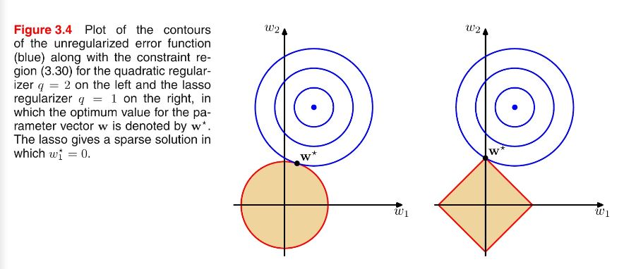

# NLP_research_interviews

## Generative AutoEncoder Models Comparison
### AE vs VAE
### VAE vs Diffusion model

## Boosting

### Self-attention
The core idea of attention is to compute Q, K, V, which is imported from recommondation system. Q represents the aspects we are interested in, K represents the aspects that the data have, while V represents the actual information of different aspects. The output of a self-attention layer is just a weighted average of the channels of the input features. By default, e.g. BERT, Q, K, V should have the same dimensions. However, this is not necessary. The attended output should have less dimension than the input features. For example, if K and V have dimension [T+R, d], while Q has [R, d] (because we are only interested in less channel/features than the input.), then the score metrics F(Q, K) has dimension [R, T+R], which behaves more like a feature selection/projection matric. The the atteneded output is [R, d], which has the same dimension with Q.

## NLG Metrics
- BLEU: Range 0 to 1, based on Precisions of n-gram. Short sentence tends to get high value, therefore length penalty.
- ROUGE: Based on Recall, 4 different methods: Rouge-L (longest common subsequence), Rouge-N (n-gram recall), Rouge-W (weighted longest common subsequence), Rouge-S (n-gram, but allow skip). Recall, which means how many n-gram of the reference are matched by the generated sequence.
- Precision, Recall and F1: Accuracy is not good enough for imbalance dataset. Precision: For all positive prediction, what's the percentage for true positive. Recall: For all positive data, what's the percentage that are successfully predicted as positive. When False negative is expensive, Recall > Precision. When False positive is expensive, Precision > Recall. F1 is a combination of Recall and Precision. For multi-class classification problem, each class has its own Precision and Recall. To consider overall classification performance in one score, there are three methods to calcualte: Macro-average, Weighted-average and Micro-average.  
- ROC-AUC: ROC curve (receiver operating characteristic curve) is a graph showing the performance of a classification model at all classification **thresholds**.

## Softmax details

## Loss function
- Cross-entropy: 

## DL training details
### Miscellaneous details
- K-fold: 2-fold has problems 1) Model performance depends on the splitting of train and valid set. 2) Model only trained on part of the data. Therefore ** cross-validation**, split dataset into k portion. Iteratively train k models and evaluate on the k valid sets. The average loss is more accurate.
- How to tune hyper-parameters (such as lr)
- Overfit/underfit: If **overfitting**, two possible solutions: 1) **Regularization**, keep all features but reduce number of parameters. 2) **Remove noisy features** by hand or methods such as PCA.
- Batch Normalization 

### Regularization
  

- **L1, L2**: Regularization can alleviate overfitting and improve ability to generalize. L1 is equivalent to Laplace prior (sum of absolute value), L2 is Gaussian prior (sum of squared value). Prior means the prior knowledge of the value distribution of weights/parameters. L1 tends to give **sparse parameters**, while L2 tends to give parameters with **small values**. (Sparse parameter is good because less parameters are used, some weights become 0. It can be helpful for **feature selection** and therefore provide **interpretability**. Small parameter value is good because a samll change of the input data wouldn't give large shift on the predicting result, which means more robustness. More parameters are used means the model wouldn't only depend on few features, which provide generalization ability.) L1 doesn't provide an analytical solution (due to the absolute operation), but it can be compatible with sparse algorithms, while L2 has analytical solution, as it keeps the loss **continuous** and therefore can be calculated more **efficiently by gradient descent**. L1 is not sensitive with abnormal data/parameters, as L2 will emphasis them. Therefore L1 is more robust for noisy situation, but L2 is better choice when the anormaly is valuable for the study. 
- **Dropout**: 1) Dropout is equivalent to train multiple submodels with randomly less neuros, which means when predicting, model works like voting. 2) Increase robustness, as features are forced to depend on different neurons, rather than a fixed set of neurons. 
- **Batch Normalization & layer normalization**
- **Early stopping**

### Gradient vanish & explode
They both result in unstable gradient. They are caused by
- **Too deep** NN (too many layers). For a deep NN with multiple layers, if the average gradient > 1, gradient updates will increase exponentially, which leads to gradient explode. The top layer will be updated much faster than the bottom layers. If the average gradient < 1, gradient vanishing.
- The choice of **activation functions** could lead to increasing/decreasing average gradients.
- Too large **initial weights**.
Potential solution:
- Use ReLU, Leaky-ReLU rather than Sigmoid or tanh.
- Batch normalization.

### Activation functions
Why do we want activation functions?
The development of activation functions: Sigmoid->Tanh->ReLU->Leaky ReLU->Maxout
- Sigmoid: Value range [0,1], which is suitable for outputing probability. Outdated for latest NN. Limitations: 1) Sigmoid could get **saturated** and lead to **gradient vanish** when value goes to 0 or 1, which means too small backward propogation error. 2) Sigmoid is **[not zero-centered](https://rohanvarma.me/inputnormalization/)**, which leads to zipzap trajectory when gradient descent. 3) The gradient of Sigmoid ranges (0, 0.25), back propogation could lead to gradient vanishing.
- Tanh: Value range (-1, 1). **Zero-centered**, but still has problem of **saturation**. (Too prevent saturation, the latest popular method is to have a **batch normalization** before activation function.)
- ReLu: Greatly **speed up** the convergence of **stochastic gradient descent**. When **calcualting gradient, ReLU almost consumes no computation**, while Sigmoid and Tanh requires differentiating exp. Character: 1) Single-side inhibition. 2) Relatively wide active range. 3) Sparse activation. Limitations: ReLU unit is vulnerable and could irreversible die. (A proper learning rate could lower the chance of killing a ReLU.)
- Leaky ReLU: Give a very small negative gradient, which means the negative gradient woundn't lost completely.

### Attention vs LSTM
RNN is hard to parallelize because of its sequential nature. CNN can parallelize, but each filter/kernel can only see limited vectros. Filters from higher layer have potential to see more vectors. Self-attention layer has Q, K, V and token at any position can attend other tokens at any positions. Self-attention has similar idea with CNN, but has more parameters and therefore is more flexible and needs more training data, e.g. ViT has 300M training pictures, but if only trained on ImageNet, its performance is worse than CNN. 

## Optimization methods
### SGD

## Decoding method:
- [Greedy, top-k and top-p](https://docs.cohere.ai/docs/controlling-generation-with-top-k-top-p): Greedy, always pick the token with highest likelihood. Top-k, pick top-k tokens and sample from them based on their likelihood. Top-p (Nucleus sampling), pick top-p tokens whose probability add up to a threshold e.g. 75%, and sample from them based on their likelhood.
- Beam search
- Classifier-conditioned decoding methods, e.g. FUDGE
- LogicDecoding, Entropy-based decoding

