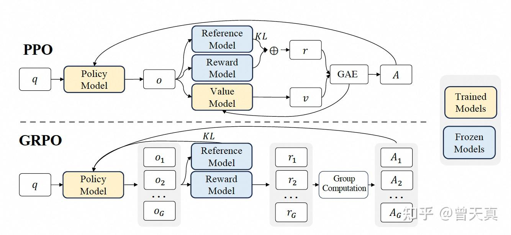

# RLHF

## Terms
- Policy 
- Environment/Reward
- State
- Action
- **Value**: Value is the total expected future reward. There are two value functions: Action value $Q(s_t, a_t)$ and state value $V(s_t)$.
$Q(s_t, a_t) = r_{t+1} + V(s_{t+1})$

- **Advantage**: Advantage function  $A(t)$ defines given state $s_t$, the advantage of choosing action $a_t$ than average actions. 
$A_t = Q(s_t, a_t) - V(s_t)$ 

## Basic concepts
- **On/off-policy Learning**: The learning of $\pi_t$ is on-policy, if the responses are sampled from $\pi_t$ with $x_i$ as inputs.
- **Online/offline Learning**: The learning of $\pi_t$ is online, if the preference oracle $\mathcal{P}(x,a^1,a^2)$ or its approximator $\hat{\mathcal{P}}(x,a^1,a^2)$ can be queried over training. More variants:
  - Squential/fully/batch-wise online: Query preference oracle for each batch.
  - Iterative online: ... every T batches.
  - Hybrid online: Initial offline dataset + online exploration.

## Reward Model

#### Modeling 
- Classical Bradley-Terry Model (BT Estimation)

- Bradley-Terry Regression

#### RM for Mathmatic Reasoning

- Stepwise Dense Reward

- RLVR

#### RM from demonstrations
##### Inverse RL
- **Reverse KL**: When using Q to approximate P, Forward KL is $D_{KL}(P||Q)$, reverse is KL(Q||P). Forward KL will make Q try to **cover all mass** of P, while reverse KL will make Q **match the most significant mode** of P.

#### Core Challenges
- Reward Overoptimization: Reward models are overfitted on the data - e.g. **Reward Hacking**: Potential solutions 1) Incorporate uncertainty estimation into reward modeling, often via ensemble methods. 2) Regularizing the learning process by incorporating auxiliary objectives such as generative predictions - e.g. Generative Reward Model.
- Offline Dataset: Static data - Off-policy dataset: Potential solutions 1) Online-learrning 2) Active preference collections.

# PPO & GRPO
1) In RLHF PPO, usually 4 models are maintained: Policy model, Reference model, Value model and Reward Model. Value model is usually similar size as the policy model, which is expensive.
GRPO gets rid of value model, but using **Average Rewards of multiple samples** as baseline. Each reward is normalized by subtracting meaning $mean(r)$ and divided by standard deviation $std(r)$. The normalized reward is applied to every token, but not only in the end.
  

2) PPO puts the **KL penalty into the rewards**, while GRPO puts the **KL into the loss function of policy updateing**. This simplify the training